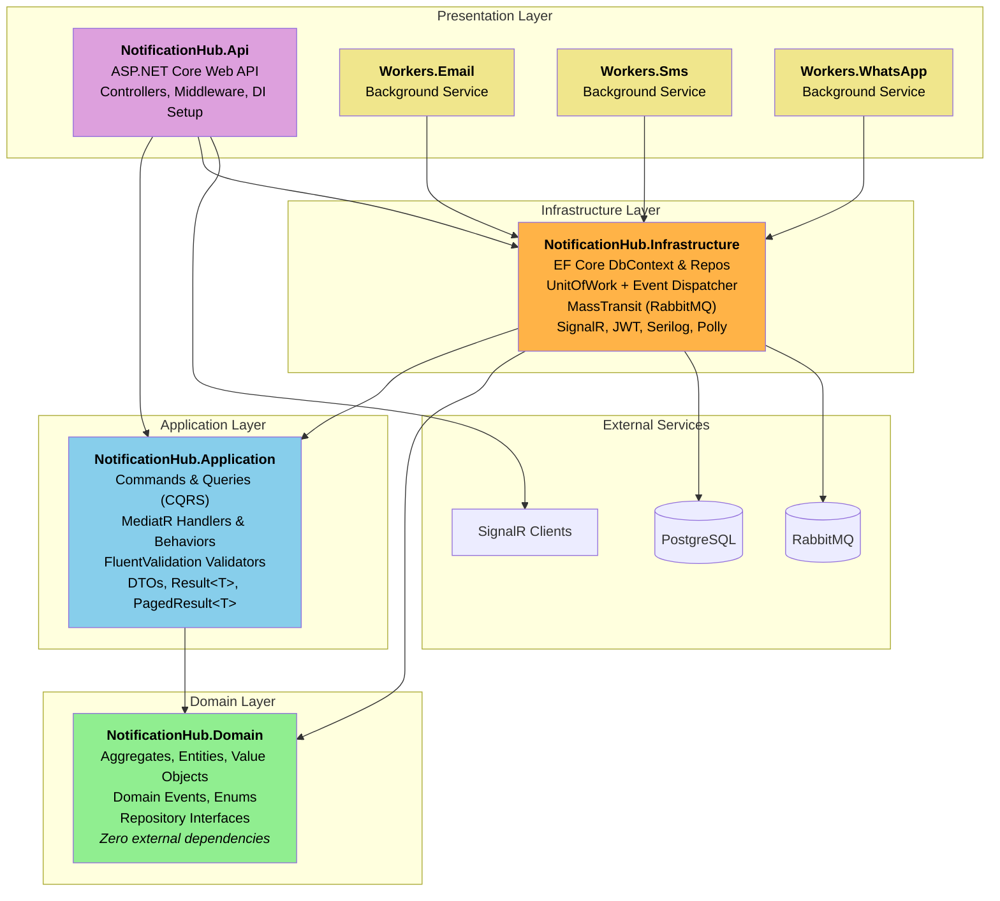
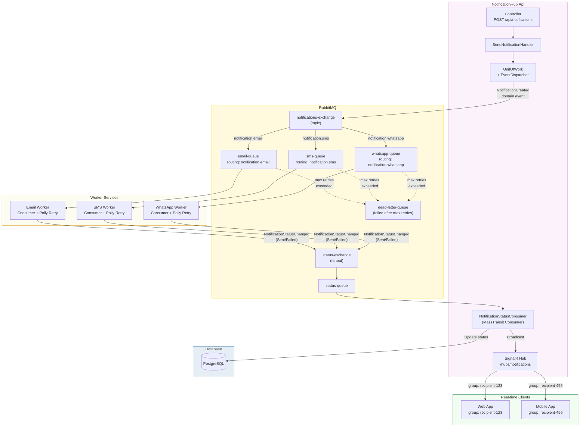
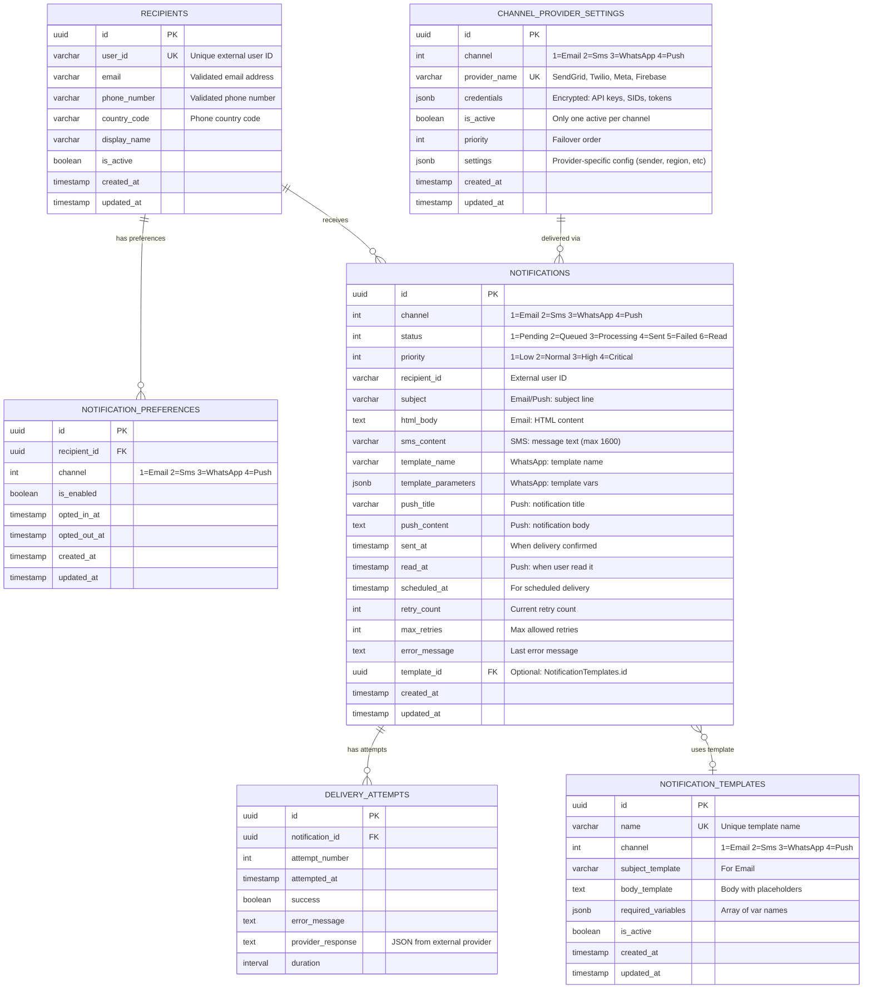

# Realtime Notification Hub - Architecture Diagrams

> Reference diagrams for the Clean Architecture + DDD restructuring (Fase 0).
> Render with [Mermaid Preview](https://marketplace.visualstudio.com/items?itemName=bierner.markdown-mermaid) in VS Code or at [mermaid.live](https://mermaid.live).

---

## 1. Project Dependencies

The **dependency rule** of Clean Architecture: inner layers never know about outer layers. Domain has zero external dependencies.

---

## 2. Domain Model

### Key change from current state

The current TPH hierarchy (`abstract Notification` → `EmailNotification`, `SmsNotification`, `WhatsAppNotification`, `PushNotification`) is **replaced** by a single `Notification` entity with:
- Static factory methods (`CreateEmail()`, `CreateSms()`, etc.)
- Optional channel-specific fields (`Subject`, `HtmlBody`, `SmsContent`, etc.)
- State transition methods (`MarkAsQueued()`, `MarkAsSent()`, etc.) that enforce business rules and raise domain events

```mermaid
classDiagram
    direction TB

    %% ───────── Base Classes ─────────
    class Entity {
        <<abstract>>
        +Guid Id
        +DateTime CreatedAt
        +DateTime? UpdatedAt
        #List~IDomainEvent~ _domainEvents
        +AddDomainEvent(IDomainEvent)
        +ClearDomainEvents()
        +GetDomainEvents() IReadOnlyList
    }

    class AggregateRoot {
        <<abstract>>
    }

    class ValueObject {
        <<abstract>>
        #GetEqualityComponents()* IEnumerable~object~
        +Equals(object?) bool
        +GetHashCode() int
    }

    class IDomainEvent {
        <<interface>>
        +Guid EventId
        +DateTime OccurredOn
    }

    AggregateRoot --|> Entity

    %% ───────── Value Objects ─────────
    class EmailAddress {
        +string Value
        +Create(string) Result~EmailAddress~$
        +ToString() string
    }

    class PhoneNumber {
        +string Value
        +string? CountryCode
        +Create(string, string?) Result~PhoneNumber~$
        +ToString() string
    }

    class NotificationContent {
        +string Value
        +int Length
        +Create(string, int maxLength) Result~NotificationContent~$
        +ToString() string
    }

    EmailAddress --|> ValueObject
    PhoneNumber --|> ValueObject
    NotificationContent --|> ValueObject

    %% ───────── Enums ─────────
    class NotificationChannel {
        <<enumeration>>
        Email
        Sms
        WhatsApp
        Push
    }

    class NotificationStatus {
        <<enumeration>>
        Pending
        Queued
        Processing
        Sent
        Failed
        Read
    }

    class NotificationPriority {
        <<enumeration>>
        Low
        Normal
        High
        Critical
    }

    %% ───────── Notification Aggregate ─────────
    class Notification {
        +NotificationChannel Channel
        +NotificationStatus Status
        +NotificationPriority Priority
        +string RecipientId
        +string? Subject
        +string? HtmlBody
        +string? SmsContent
        +string? TemplateName
        +Dictionary~string,string~? TemplateParameters
        +string? PushTitle
        +string? PushContent
        +DateTime? SentAt
        +DateTime? ReadAt
        +DateTime? ScheduledAt
        +int RetryCount
        +int MaxRetries
        +string? ErrorMessage
        +Guid? TemplateId
        -List~DeliveryAttempt~ _deliveryAttempts
        +IReadOnlyList~DeliveryAttempt~ DeliveryAttempts
        +CreateEmail(string recipientId, string subject, string htmlBody, NotificationPriority) Notification$
        +CreateSms(string recipientId, string content, NotificationPriority) Notification$
        +CreateWhatsApp(string recipientId, string templateName, Dictionary params, NotificationPriority) Notification$
        +CreatePush(string recipientId, string title, string content, NotificationPriority) Notification$
        +MarkAsQueued()
        +StartProcessing()
        +MarkAsSent(DateTime sentAt)
        +MarkAsFailed(string error)
        +MarkAsRead()
        +AddDeliveryAttempt(bool success, string? error, string? providerResponse)
        +CanRetry() bool
    }

    class DeliveryAttempt {
        +Guid NotificationId
        +int AttemptNumber
        +DateTime AttemptedAt
        +bool Success
        +string? ErrorMessage
        +string? ProviderResponse
        +TimeSpan? Duration
        +Create(Guid notificationId, int attemptNumber, bool success, string? error, string? providerResponse) DeliveryAttempt$
    }

    Notification --|> AggregateRoot
    DeliveryAttempt --|> Entity
    Notification "1" *-- "0..*" DeliveryAttempt : contains
    Notification ..> NotificationChannel : uses
    Notification ..> NotificationStatus : uses
    Notification ..> NotificationPriority : uses

    %% ───────── Recipient Aggregate ─────────
    class Recipient {
        +string UserId
        +EmailAddress? Email
        +PhoneNumber? PhoneNumber
        +string? DisplayName
        +bool IsActive
        -List~NotificationPreference~ _preferences
        +IReadOnlyList~NotificationPreference~ Preferences
        +Create(string userId, EmailAddress? email, PhoneNumber? phone, string? displayName) Recipient$
        +UpdateEmail(EmailAddress email)
        +UpdatePhoneNumber(PhoneNumber phone)
        +SetPreference(NotificationChannel channel, bool enabled)
        +CanReceive(NotificationChannel channel) bool
        +Deactivate()
        +Activate()
    }

    class NotificationPreference {
        +Guid RecipientId
        +NotificationChannel Channel
        +bool IsEnabled
        +DateTime? OptedInAt
        +DateTime? OptedOutAt
        +Enable()
        +Disable()
    }

    Recipient --|> AggregateRoot
    NotificationPreference --|> Entity
    Recipient "1" *-- "0..*" NotificationPreference : contains
    Recipient ..> EmailAddress : uses
    Recipient ..> PhoneNumber : uses
    NotificationPreference ..> NotificationChannel : uses

    %% ───────── NotificationTemplate Aggregate ─────────
    class NotificationTemplate {
        +string Name
        +NotificationChannel Channel
        +string SubjectTemplate
        +string BodyTemplate
        +List~string~ RequiredVariables
        +bool IsActive
        +Create(string name, NotificationChannel channel, string subject, string body) NotificationTemplate$
        +Render(Dictionary~string,string~ variables) RenderedTemplate
        +Update(string subject, string body)
        +Activate()
        +Deactivate()
    }

    class RenderedTemplate {
        <<value object>>
        +string Subject
        +string Body
    }

    NotificationTemplate --|> AggregateRoot
    NotificationTemplate ..> NotificationChannel : uses
    NotificationTemplate ..> RenderedTemplate : produces

    %% ───────── Domain Events ─────────
    class NotificationCreatedEvent {
        +Guid NotificationId
        +NotificationChannel Channel
        +string RecipientId
        +NotificationPriority Priority
    }

    class NotificationQueuedEvent {
        +Guid NotificationId
        +NotificationChannel Channel
    }

    class NotificationSentEvent {
        +Guid NotificationId
        +DateTime SentAt
    }

    class NotificationFailedEvent {
        +Guid NotificationId
        +string ErrorMessage
        +int RetryCount
    }

    NotificationCreatedEvent ..|> IDomainEvent
    NotificationQueuedEvent ..|> IDomainEvent
    NotificationSentEvent ..|> IDomainEvent
    NotificationFailedEvent ..|> IDomainEvent

    %% ───────── Repository Interfaces ─────────
    class INotificationRepository {
        <<interface>>
        +GetByIdAsync(Guid, CancellationToken) Task~Notification?~
        +GetPagedAsync(NotificationFilter, CancellationToken) Task~PagedResult~
        +AddAsync(Notification, CancellationToken) Task
        +UpdateAsync(Notification, CancellationToken) Task
    }

    class IRecipientRepository {
        <<interface>>
        +GetByIdAsync(Guid, CancellationToken) Task~Recipient?~
        +GetByUserIdAsync(string, CancellationToken) Task~Recipient?~
        +AddAsync(Recipient, CancellationToken) Task
        +UpdateAsync(Recipient, CancellationToken) Task
    }

    class INotificationTemplateRepository {
        <<interface>>
        +GetByIdAsync(Guid, CancellationToken) Task~NotificationTemplate?~
        +GetByNameAsync(string, CancellationToken) Task~NotificationTemplate?~
        +GetAllActiveAsync(CancellationToken) Task~List~
        +AddAsync(NotificationTemplate, CancellationToken) Task
        +UpdateAsync(NotificationTemplate, CancellationToken) Task
    }

    class IUnitOfWork {
        <<interface>>
        +SaveChangesAsync(CancellationToken) Task~int~
    }
```

---

## 3. Event-Driven Architecture / Message Flow

End-to-end flow from notification creation to real-time client update.

---

## 4. Entity-Relationship Diagram (ERD)

Target database model. The `Notifications` table is a unified model (no more TPH discriminator with separate subclasses). `ChannelProviderSettings` stores external provider credentials (SendGrid, Twilio, etc.) configurable from the frontend.

