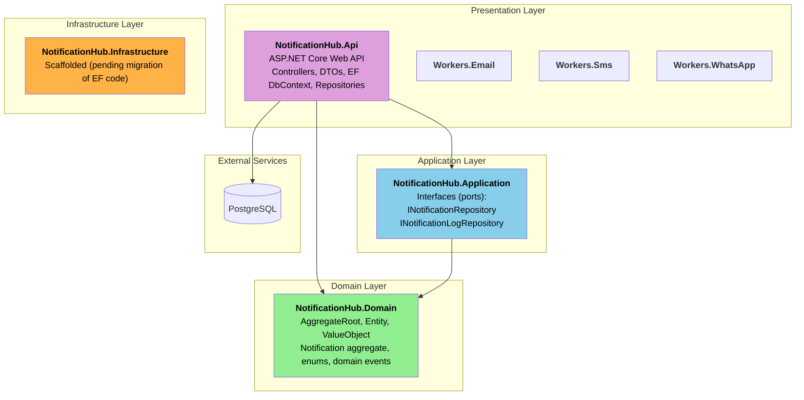
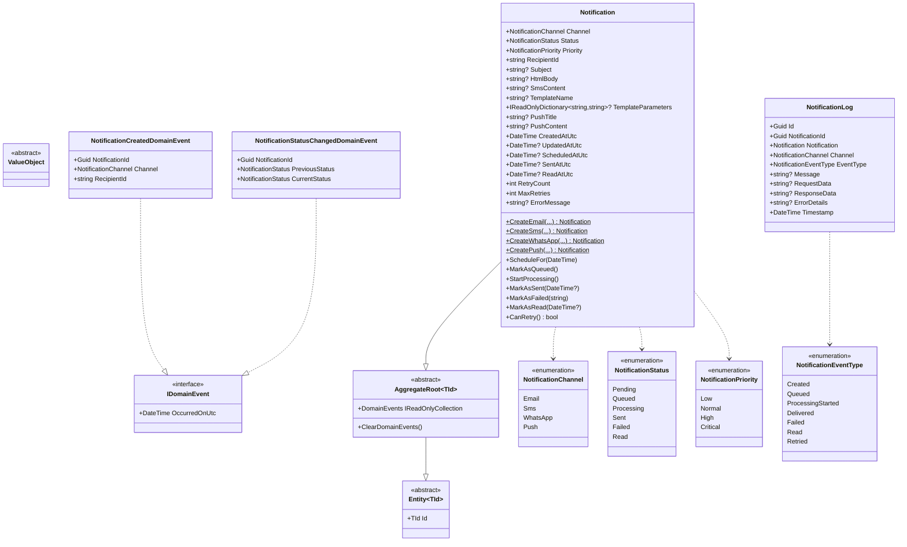
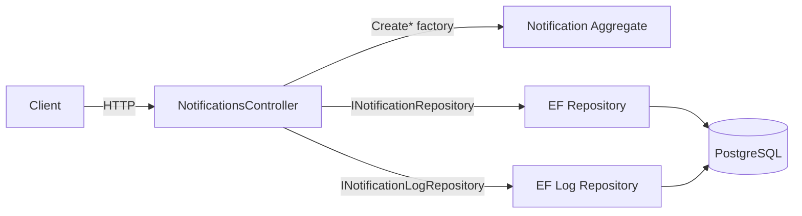
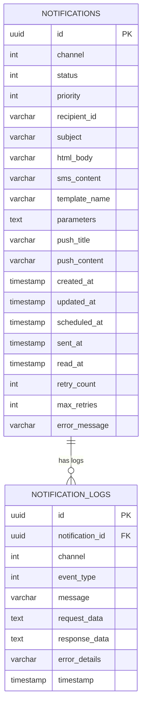

# Realtime Notification Hub - Architecture (Current State)

> This document describes the architecture implemented as of February 12, 2026.
> It intentionally avoids roadmap-only components that are not yet wired.

---

## 1. Project Dependencies

Clean Architecture dependency rule currently implemented:

- `NotificationHub.Domain`: core domain model and abstractions.
- `NotificationHub.Application`: application contracts (repository interfaces).
- `NotificationHub.Api`: presentation + EF Core persistence implementation.
- `NotificationHub.Infrastructure`: scaffolded project, not yet hosting EF/infra code.

---

## 2. Domain Model

The current model uses a single `Notification` aggregate (no TPH subclasses).

---

## 3. Runtime Flow (Current)

Current endpoints:

- `POST /api/notifications/email`
- `POST /api/notifications/sms`
- `POST /api/notifications/whatsapp`
- `POST /api/notifications/push`
- `GET /api/notifications`
- `GET /api/notifications/{id}`
- `PATCH /api/notifications/{id}/read`

---

## 4. Database Schema (InitialCreate)

Schema generated from `src/NotificationHub.Api/Migrations/20260212222008_InitialCreate.cs`.

---

## 5. Next Architectural Step

To finish the layering move, migrate EF Core artifacts from `NotificationHub.Api` to `NotificationHub.Infrastructure`:

- `NotificationDbContext`
- EF configurations
- repository implementations
- migrations folder

The API should keep only presentation concerns + DI composition.
